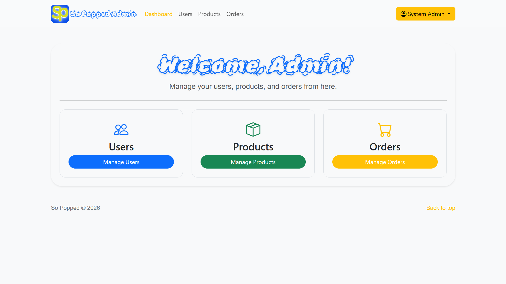
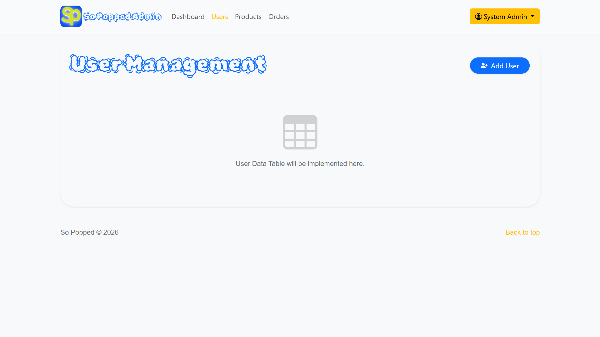
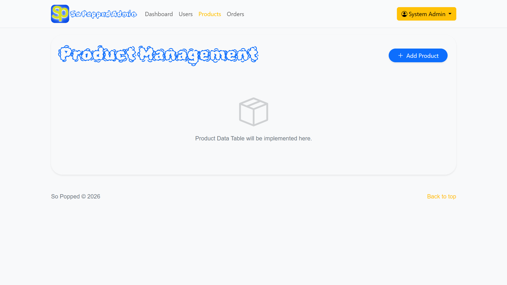
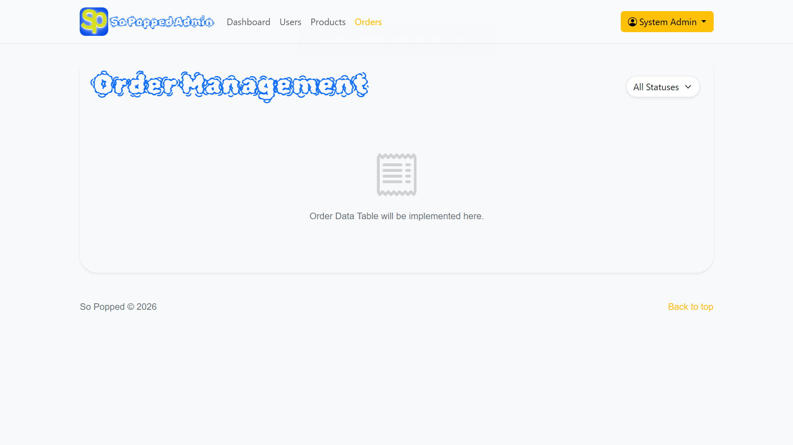

# Changelog

All notable changes to the SoPopped e-commerce project are documented in this file.

---

### 🔄 For Team Members (Git Workflow)

Since you are working on your own branches, simply **pull the latest updates from `main`** into your local branch to get the new scaffolded files. You can do this via your preferred method (Terminal, VS Code Source Control, etc.).

## 🗄️ HOW TO UPDATE OR CREATE DATABASE

### Option 1: Existing Database (Migration)

If you already have an older version of the SoPopped database:

1. **Run migrations in order:**

   - First: Execute `db/1. RUN THIS add_user_carts_table.sql` in your MySQL Workbench or RDBMS
   - Second: Execute `db/2. RUN THIS ALTER TABLE users.sql` in your MySQL Workbench or RDBMS
   - Third: Execute `db/3. RUN THIS add_contact_archiving.sql` in your MySQL Workbench or RDBMS

2. **Update credentials:**

   - Edit `config.php` with your database credentials:
     ```php
     define('DB_HOST', 'localhost');
     define('DB_NAME', 'sopopped');
     define('DB_USER', 'root');
     define('DB_PASS', 'your_password');
     ```
   - Edit `db/sopoppedDB.php` (uses `config.php` automatically)

3. **A Must: Run seed files (recommended for development)**
   - After running the migrations above, you can populate sample data and an admin account:
     - Execute `db/manual_seed_sample_products.sql` in your MySQL Workbench or RDBMS — inserts sample products
     - `php db/seed_admin.php` — creates an admin user (`admin@admin.com` / `admin123`)
   - Example (VS Code Terminal):
     ```bash
     php db/seed_admin.php
     ```
     

### Option 2: Fresh Installation

If this is your first time setting up the database or want to start fresh:

1. **Import complete schema:**

   - Execute `db/USE THIS SCHEMA.sql` in your MySQL Workbench or RDBMS
   - This creates all tables with the latest structure

2. **Update credentials:**

   - Edit `config.php` with your database credentials:
     ```php
     define('DB_HOST', 'localhost');
     define('DB_NAME', 'sopopped');
     define('DB_USER', 'root');
     define('DB_PASS', 'your_password');
     ```
   - Edit `db/sopoppedDB.php` (uses `config.php` automatically)

3. **A Must: Run seed files (recommended for development)**
   - After importing the full schema you may run the seeders to add sample products and an admin account:
     - Execute `db/manual_seed_sample_products.sql` in your MySQL Workbench or RDBMS
     - `php db/seed_admin.php`
   - Example (VS Code Terminal):
     ```bash
     php db/seed_admin.php
     ```
     

### Verification

After setup, verify your database has these tables:

- `users`
- `user_carts`
- `products`
- `orders`
- `order_items`
- `contact_messages`

---

## [3.0.0] - 2026-01-02

### 🚀 Major Release — Admin Panel Scaffolding

This major release introduces the Admin Panel scaffolding: protected admin pages, UI modals, client-side validation, and admin API endpoints. The API files under `api/admin/` are intentionally scaffolded (placeholders) — the verified implementation snippets are available in `MARKDOWNS/REPORTS/admin_task_delegation.md` and have been reviewed.

Highlights

#### 🔐 Security & Infrastructure

- **Admin Middleware** (`api/admin/check_auth.php`): A gatekeeper script that verifies if the current session belongs to an authorized admin before allowing any API access.
- **Frontend Validation** (`admin/js/admin-validation.js`): Centralized rules for verifying form inputs (like email formats, prices, and required fields) before they reach the server.
- **Admin Dashboard** (`admin/dashboard.php`): The secure entry point for the admin panel, featuring navigation and protected access.



#### 👥 Package A: User Management Feature

- **Admin Page** (`admin/users.php`): The main interface for viewing, searching, and managing user accounts.



- **User Modal** (`admin/components/user_modal.php`): A reusable dialog for creating new admins or editing existing user details.


- **API Endpoints**:
  - `get_users.php`: Fetches the list of all users with role and status.
  - `save_user.php`: Handles creating new users and updating existing profiles.
  - `delete_user.php`: Soft-deletes (archives) a user account to prevent login.

#### 📦 Package B: Product Management Feature

- **Admin Page** (`admin/products.php`): The grid/list view for managing the product catalog.



- **Product Modal** (`admin/components/product_modal.php`): The form for adding new merchandise or updating prices, stock, and images.


- **API Endpoints**:
  - `get_products.php`: Retrieves the product inventory.
  - `save_product.php`: Processes product creation and updates.
  - `delete_product.php`: Marks products as inactive (archived) so they don't appear in the shop.

#### 🛍️ Package C: Order Management Feature

- **Admin Page** (`admin/orders.php`): The control center for viewing and filtering customer orders.



- **API Endpoints**:
  - `get_orders.php`: Fetches order history with filtering capabilities.
  - `update_order_status.php`: Updates the status of an order (e.g., from 'Pending' to 'Shipped').

#### 📊 Package D: Dashboard Intelligence Feature

- **Admin Dashboard Stats** (`admin/dashboard.php`): Dynamically displays real-time statistics on the dashboard cards.
- **API Endpoints**:
  - `get_dashboard_stats.php`: Fetches efficient counts for Total Users, New Users, Products, Low Stock, Orders, and Pending Orders in a single query.

#### 🗂️ Admin Scaffolding File Structure

```
SoPopped/
├── admin/                    # Admin Panel Frontend pages (Protected)
│   ├── components/           # Reusable UI components
│   │   ├── footer.php        # Admin footer
│   │   ├── header.php        # Admin header with nav
│   │   ├── product_modal.php # Product add/edit modal
│   │   └── user_modal.php    # User add/edit modal
│   ├── js/                   # Admin-specific JavaScript
│   │   ├── admin-ui.js       # Shared modal & form submission logic
│   │   └── admin-validation.js # Frontend form validation rules
│   ├── dashboard.php         # Admin Dashboard (Entry point)
│   ├── orders.php            # (Scaffold) Order Management (View/Filter orders)
│   ├── products.php          # (Scaffold) Product Management (Grid/List view)
│   └── users.php             # (Scaffold) User Management (Role assignment)
├── api/admin/                # Admin API Endpoints (Secure)
│   ├── check_auth.php        # Middleware: Session/Role verification
│   ├── delete_product.php    # (Scaffold) Archive product logic
│   ├── delete_user.php       # (Scaffold) Archive user logic
│   ├── get_dashboard_stats.php # (Scaffold) Fetch dashboard counts
│   ├── get_orders.php        # (Scaffold) Fetch filtered orders
│   ├── get_products.php      # (Scaffold) Fetch paginated products
│   ├── get_users.php         # (Scaffold) Fetch paginated users
│   ├── save_product.php      # (Scaffold) Create or Update product
│   ├── save_user.php         # (Scaffold) Create or Update user
│   └── update_order_status.php # (Scaffold) Update order status
```

Developer notes

- The verified snippets live in `MARKDOWNS/REPORTS/admin_task_delegation.md`. I have reviewed those snippets and confirm they are correct and safe to paste into the matching `api/admin/*.php` files to enable full admin functionality.
- The current live API files remain scaffolded — they intentionally do not contain the full snippets. This keeps the repository safe, but more importantly, **this is the task that you need to do**: you must apply the snippets to your assigned files to complete the feature.
- Admin frontend pages (`admin/users.php`, `admin/products.php`, `admin/orders.php`) are also scaffolds: their table HTML and scripts are available in `MARKDOWNS/REPORTS/admin_task_delegation.md` and can be pasted in when you are ready.

Seeders (development convenience)

- Included seed files:
  - Execute `db/manual_seed_sample_products.sql` in your MySQL Workbench or RDBMS — sample product rows
  - `db/seed_admin.php` — PHP script to seed admin user (`admin@admin.com` / `admin123`)

Status: Major Release (3.0.0) — Admin scaffolding merged; implementation snippets verified and available for application.

## [2.0.0] - 2025-11-06

### 🎉 Major Release - Complete E-Commerce Platform

#### ✨ Added - Core Features

**User Authentication & Management**

- Secure login system with password hashing (`password_hash`/`password_verify`)
- User registration with email validation
- Session management with `$_SESSION` for authentication state
- Logout functionality
- Account archiving system (soft delete with `is_archived` flag)
- Role-based user system (customer/admin) for future admin panel
- Middle name support in user profiles
- Duplicate email prevention during signup
- Active session detection API (`api/session_info.php`)

**Product Catalog**

- Dynamic product listing from database
- Product details modal with image, description, price
- Stock quantity tracking and validation
- Product pagination (6 items per page)
- Out-of-stock indicators and prevention
- Active/inactive product status
- SKU-based product management
- Product image path support (local and remote URLs)

**Shopping Cart System**

- Dual-storage cart (localStorage for guests + database for logged-in users)
- Add/remove items without page reload (AJAX)
- Real-time quantity adjustment with +/- controls
- Stock validation on cart operations
- Cart badge with live item count
- Cart persistence across sessions for authenticated users
- Server-side cart synchronization
- Cart prefetch on login
- Automatic cart cleanup after checkout
- Empty cart state with friendly messaging

**Checkout & Orders**

- Complete checkout flow with billing form
- Philippines address system (Province/City/Barangay dropdowns)
- Order creation with atomic transactions
- Stock decrement on purchase
- Order items tracking with price snapshots
- Payment method support (COD initially)
- Order confirmation page with receipt
- Shipping address storage (JSON format)
- Purchased items removal from cart

**Contact System**

- Contact form on About Us page
- Message storage in database
- Contact message archiving capability
- Email validation

#### 🏗️ Technical Implementation

**Backend (PHP)**

- OOP Database class with PDO
  - `getConnection()` - Returns PDO instance
  - `query($sql, $params)` - Prepared statements
  - `fetchAll($sql, $params)` - Fetch multiple records
  - `fetchOne($sql, $params)` - Fetch single record
- Centralized configuration (`config.php`)
- Helper functions library (`api/_helpers.php`):
  - `sp_ensure_session()` - Session initialization
  - `sp_json_response()` - JSON response wrapper
  - `sp_is_ajax_request()` - AJAX detection
  - `sp_json_header()` - JSON header setter
- RESTful API endpoints in `/api/` directory
- Input sanitization with `htmlspecialchars()` and `trim()`
- Email validation with `filter_var(FILTER_VALIDATE_EMAIL)`
- SQL injection prevention via prepared statements
- Transaction support for critical operations

**Frontend (JavaScript/jQuery)**

- Modular JavaScript architecture:
  - `authDialogs.js` - Login/signup modal handlers
  - `cart.js` - Cart manager with localStorage
  - `cart-badge.js` - Cart count badge updater
  - `cartHelpers.js` - Cart utility functions
  - `cartPrefetch.js` - Server cart loader
  - `cardAnimations.js` - Product card animations
  - `countryState.js` - Philippines address data
  - `fetchHelper.js` - Centralized AJAX wrapper
  - `sessionHelper.js` - Session state management
  - `validateHelper.js` - Form validation utilities
  - `uiHelper.js` - UI helper functions
  - `productModal.js` - Product modal controller
  - `productLoader.js` - Product data loader
  - `loadComponents.js` - Component loader
  - `sopoppedValidate.js` - Validation framework
- jQuery-based AJAX operations
- Bootstrap 5 modal dialogs
- Real-time form validation
- Event-driven architecture
- Global namespace management (`window.sopoppedCart`, etc.)

**Database Schema**

- `users` table:
  - Fields: id, email, password_hash, first_name, middle_name, last_name, phone, role, is_archived
  - Unique email constraint
  - Timestamps (created_at, updated_at)
- `user_carts` table:
  - Fields: user_id (PK), cart_json (JSON), updated_at
  - Foreign key to users with CASCADE delete
- `products` table:
  - Fields: id, sku, name, description, price, quantity, image_path, is_active
  - Price/quantity non-negative constraints
  - Unique SKU constraint
- `orders` table:
  - Fields: id, user_id, total_amount, status, payment_method, shipping_address (JSON)
  - Status enum: pending, paid, shipped, cancelled
  - Foreign key to users (SET NULL on delete)
- `order_items` table:
  - Fields: id, order_id, product_id, price_at_purchase, quantity
  - Foreign keys with appropriate cascade/restrict rules
- `contact_messages` table:
  - Fields: id, name, email, message, is_archived, archived_by, archived_at
  - Archiving support with user tracking

**Reusable Components**

- `components/navbar.php` - Navigation with active link highlighting
- `components/footer.php` - Footer with links
- `components/login.php` - Login modal dialog
- `components/signup.php` - Signup modal dialog
- `components/product_modal.php` - Product details modal
- `components/pagination.php` - Page navigation component

**API Endpoints**

- `api/login_submit.php` - User authentication (supports AJAX + form)
- `api/signup_submit.php` - User registration (supports AJAX + form)
- `api/logout.php` - Session destruction (supports AJAX + redirect)
- `api/session_info.php` - Session status check (JSON)
- `api/cart_save.php` - Save cart to database (JSON)
- `api/cart_load.php` - Load cart from database (JSON)
- `api/checkout_submit.php` - Process checkout (JSON)
- `api/contact_submit.php` - Submit contact message
- `api/check_user_exists.php` - Email availability check
- `api/db_products.php` - Product data API

#### 🎨 Pages

- `home.php` - Homepage with hero section and featured flavors
- `products.php` - Product catalog with pagination and modal
- `cart.php` - Shopping cart with checkout form
- `aboutUs.php` - About page with contact form
- `order_success.php` - Order confirmation with receipt

#### 🔒 Security Features

- Password hashing with `PASSWORD_DEFAULT` (bcrypt)
- Password verification with `password_verify()`
- Prepared statements for all database queries
- SQL injection prevention
- XSS prevention via `htmlspecialchars()`
- Session-based authentication
- CSRF protection ready (tokens can be added)
- Input validation on both client and server side
- Email normalization (lowercase)
- Archived account login prevention

#### 📱 Responsive Design

- Bootstrap 5 framework
- Mobile-first approach
- Responsive navigation with hamburger menu
- Card-based product layout
- Flexible grid system
- Touch-friendly controls
- Responsive forms
- Modal dialogs for better UX

#### 🎯 User Experience Enhancements

- Live cart badge counter
- Empty state messages (cart, products)
- Loading states for async operations
- Success/error feedback messages
- Product modal with image zoom capability
- Quantity controls (+/- buttons)
- Stock availability indicators
- Smooth animations and transitions
- Form validation with helpful error messages
- Persistent cart across sessions
- Auto-populated user info for logged-in users

#### 📦 Dependencies

- jQuery 3.x
- Bootstrap 5.x
- jQuery Validation Plugin
- Font Awesome / Bootstrap Icons (for icons)
- PDO (PHP Data Objects)
- MySQL 5.7+

#### 🗂️ File Structure

```
SoPopped/
├── api/                      # Backend API endpoints
│   ├── _helpers.php         # Utility functions
│   ├── cart_load.php
│   ├── cart_save.php
│   ├── check_user_exists.php
│   ├── checkout_submit.php
│   ├── contact_submit.php
│   ├── db_products.php
│   ├── login_submit.php
│   ├── logout.php
│   ├── session_info.php
│   └── signup_submit.php
├── components/               # Reusable PHP components
│   ├── footer.php
│   ├── login.php
│   ├── navbar.php
│   ├── pagination.php
│   ├── product_modal.php
│   └── signup.php
├── db/                       # Database files
│   ├── 1. RUN THIS add_user_carts_table.sql
│   ├── 2. RUN THIS ALTER TABLE users.sql
│   ├── USE THIS SCHEMA.sql
│   ├── manual_seed_sample_products.sql
│   ├── README-migrations.md
│   └── sopoppedDB.php
├── js/                       # JavaScript modules
│   ├── authDialogs.js
│   ├── cardAnimations.js
│   ├── cart.js
│   ├── cart-badge.js
│   ├── cartHelpers.js
│   ├── cartPrefetch.js
│   ├── countryState.js
│   ├── fetchHelper.js
│   ├── loadComponents.js
│   ├── productLoader.js
│   ├── productModal.js
│   ├── sessionHelper.js
│   ├── sopoppedValidate.js
│   ├── uiHelper.js
│   ├── uiHelpers.js
│   └── validateHelper.js
├── images/                   # Product and UI images
├── node_modules/            # Frontend dependencies
├── APPLY THIS CONCEPT.md    # Architecture reference
├── CHANGELOG.md             # This file
├── README                   # Project documentation
├── aboutUs.php
├── cart.php
├── config.php               # Database configuration
├── home.php
├── order_success.php
├── package.json
├── package-lock.json
├── postcss.config.js
├── products.php
└── styles.css
```

#### 🐛 Bug Fixes

- Fixed cart persistence across page refreshes
- Fixed stock validation preventing over-ordering
- Fixed session state synchronization
- Fixed image path resolution for products
- Fixed cart badge not updating immediately
- Fixed duplicate email registration attempts
- Fixed archived account login attempts

#### 🔧 Configuration

- Database credentials centralized in `config.php`
- Environment-based configuration support
- Charset set to UTF-8 (utf8mb4)
- PDO error mode set to exceptions
- Emulated prepares disabled for security

#### 📝 Code Quality

- File header comments on all JavaScript files
- Consistent naming conventions
- DRY principle with shared utilities
- Centralized constants for magic numbers
- Modular architecture
- Proper error handling and logging
- Validation on both client and server
- Transaction safety for critical operations

#### ⚠️ Known Limitations

- No user dashboard for order history (planned)
- No admin panel (planned)
- Search functionality not yet implemented
- Only COD payment method (others planned)
- No email notifications (planned)
- No password recovery system (planned)

---

## [1.0.0] - Initial Concept

### Added

- Initial project structure
- Basic HTML pages
- Static product display
- Simple styling

**Note:** This changelog follows [Semantic Versioning](https://semver.org/) and [Keep a Changelog](https://keepachangelog.com/) format.
