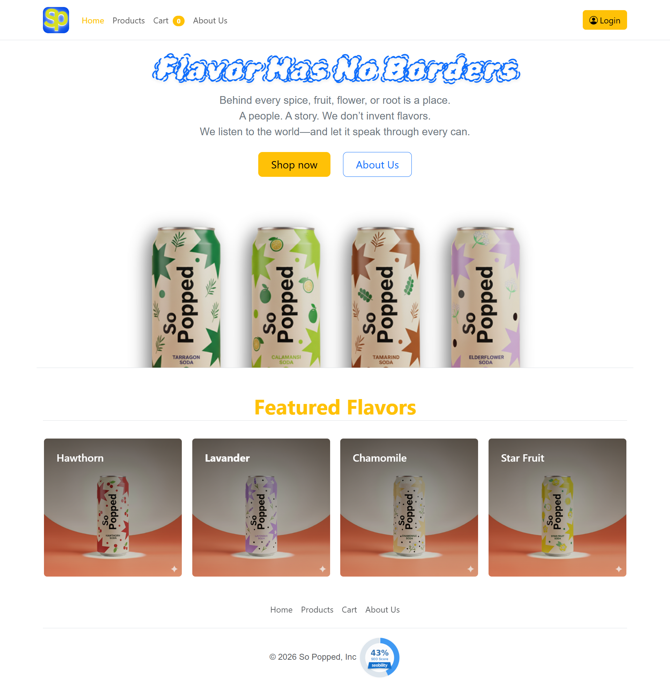
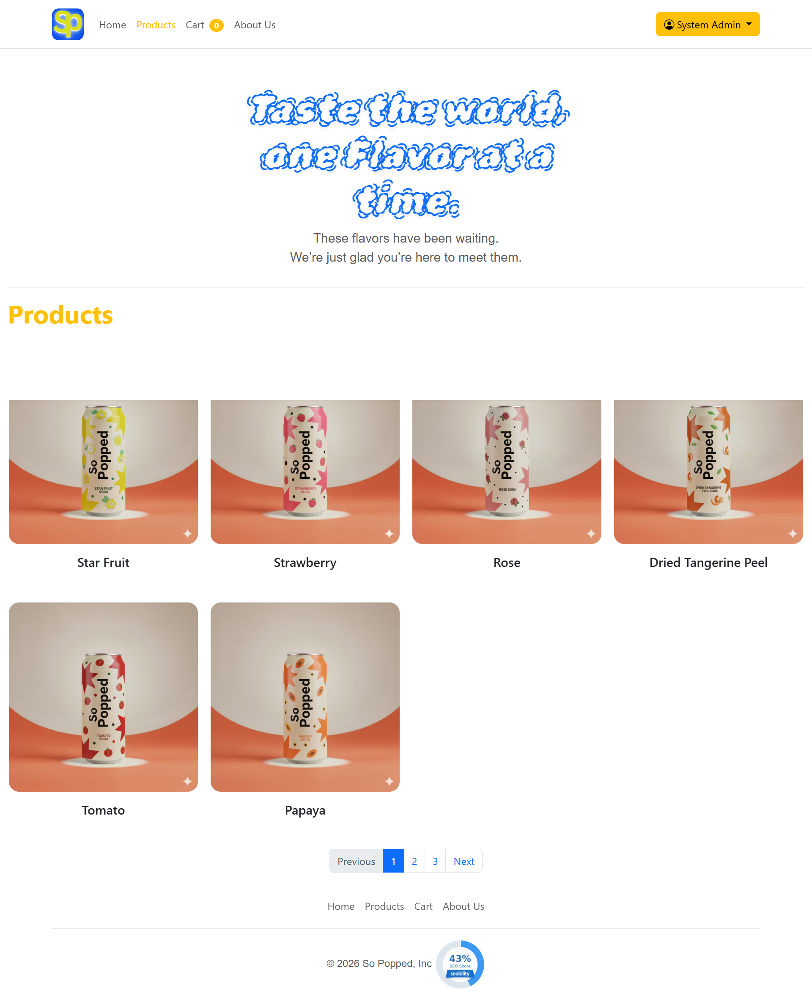
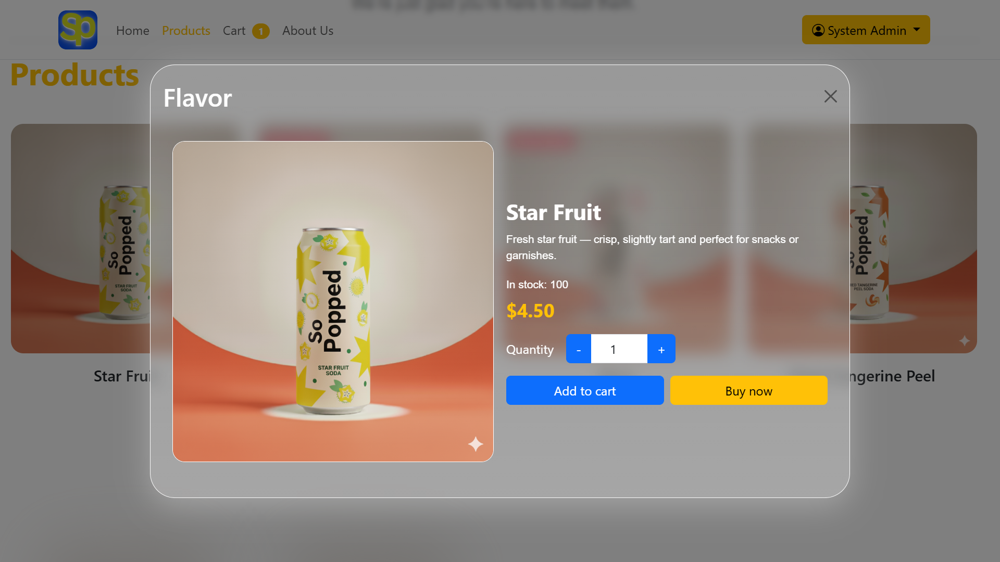
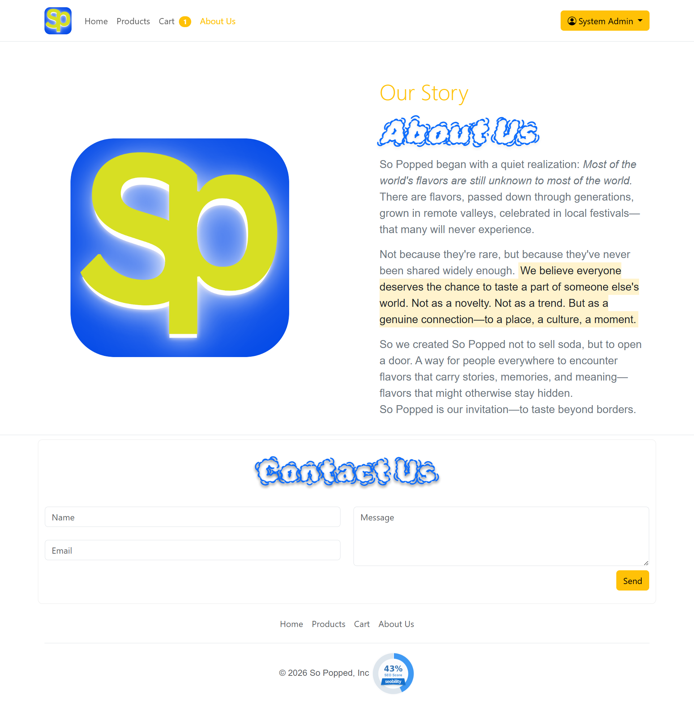
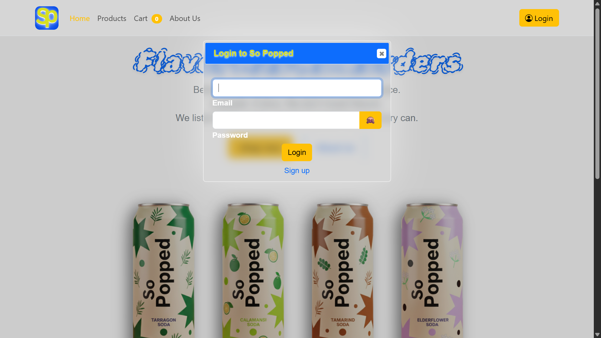
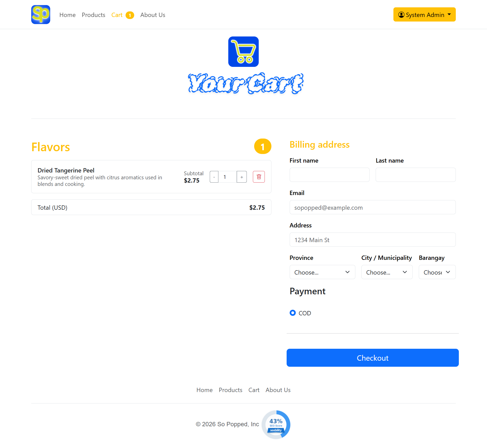
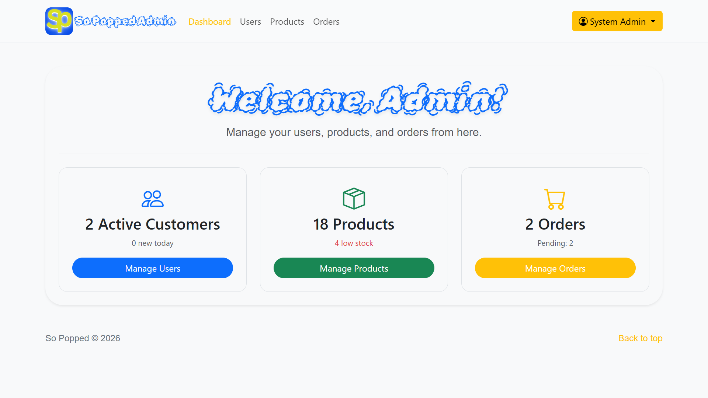
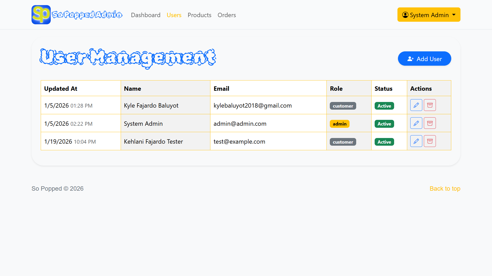
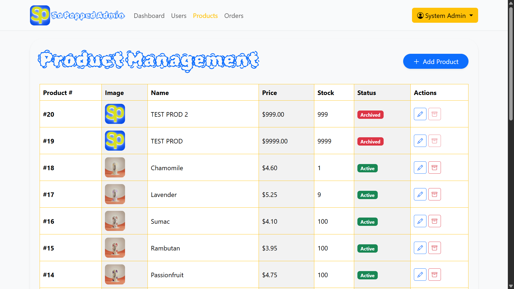
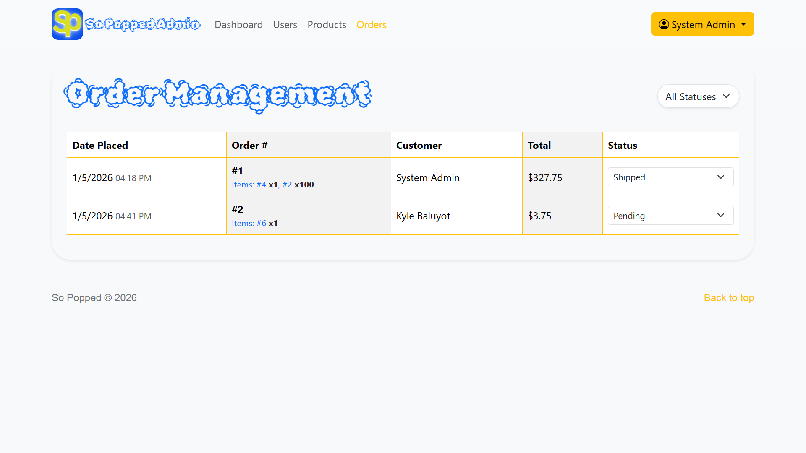

# So Popped - Flavor Has No Borders

**BSIT 3 - 1 COMP 016 - Web Development - Group Activity**

## Executive Summary

**So Popped** is an e-commerce platform built on the belief that "Flavor Has No Borders." We aim to bring global flavors to local doorsteps, sharing the stories and cultures behind every spice, fruit, and ingredient. Our system provides a seamless browsing and purchasing experience for customers, inviting them to taste the world, one flavor at a time. The platform features a dynamic product catalog, user account management, and a dedicated administration portal for managing business operations.

---

## 👥 Members / Collaborators

- 2023-00354-SP-0 BALUYOT, KYLE FAJARDO
- 2023-00385-SP-0 CONSORTE JR., FRANCISCO LAPADA
- 2023-00378-SP-0 PALEC, JHONABELLE HISTORILLO
- 2023-00389-SP-0 RANCHEZ, JAMES BOND MIRASOL
- 2023-00393-SP-0 SAMUDIO, JOSHUA BUNDALIAN

---

## 🔐 Admin Access

To manage the system, use the following default credentials to log in to the Admin Dashboard:

- **Email**: `admin@admin.com`
- **Password**: `admin123`

---

## 🧭 Navigation User Manual

### 🛒 Customer Interface

#### 1. Home Page `home.php`

The landing page introduces the brand with a visually immersive "Flavor Has No Borders" hero section.

- **Responsive Hero Section**: Adapts to screen sizes with a clear call-to-action ("Shop Now").
- **Featured Flavors**: Displays a curated selection of 4 signature flavors (Hawthorn, Lavender, Chamomile, Star Fruit) using a responsive card grid layout.
- **Navigation**: Persistent top bar for easy access to Shop, About Us, and Account features.



#### 2. Products Page `products.php`

A robust catalog interface driven by `js/productLoader.js` for seamless browsing.

- **Dynamic Data Loading**: Products are fetched asynchronously from `api/db_products.php` to ensure up-to-date inventory status.
- **Client-Side Pagination**: Implements a 6-item limit per page to improve performance and readability, with custom JavaScript logic for navigation without page reloads.
- **Live Stock Indicators**:
  - Products with `quantity <= 0` are automatically visually dimmed.
  - A "Out of Stock" badge is dynamically overlayed to prevent accidental orders.
- **Smart Image Handling**: Automatically detects broken image links and swaps them for a branded placeholder (`images/default.png`) to maintain layout integrity.



#### 3. Product Details (Modal) `js/productModal.js`

Clicking any product card opens an interactive modal overlay, keeping the user context preserved.

- **Instant Interaction**: Modal populates instantly using data attributes from the clicked card (`data-product-id`, `data-price`, etc.), avoiding unnecessary network round-trips.
- **Quantity Control**: Integrated stepper input allows users to select quantity, capped at the available stock level.
- **Add to Cart**:
  - Verifies user session (`api/session_info.php`).
  - Adds item to local/database cart via `js/cart.js`.
  - Triggers a UI toast notification upon success.



#### 4. About Us `aboutUs.php`

Connects the brand story with customer engagement.

- **Narrative Content**: Presents the "Flavor Has No Borders" mission statement.
- **Integrated Contact Form**:
  - Submits directly to `api/contact_submit.php`.
  - **Validation**: Enforces name (>2 chars) and message length (>10 chars) constraints before submission.
  - **Feedback**: Displays real-time success/error alerts without reloading the page.



#### 5. Authentication `components/login.php` & `signup.php`

Secure modal-based authentication system available from any page.

- **Unified Access**: Login handles both Customers and Admins, redirecting to `home.php` or `admin/dashboard.php` based on the `role` column in the database.
- **Security Checks**:
  - **Archived Account Prevention**: Checks `is_archived` flag during login to block deactivated users.
  - **Duplicate Prevention**: Signup checks against existing emails via `api/check_user_exists.php` before submission.
- **Cart Synchronization**: Automatically merges a guest's local cart items into their database cart (`user_carts` table) upon successful login.




#### 6. Shopping Cart & Checkout

A comprehensive order processing system designed for data integrity.

- **Dual-Persistence Cart**:
  - **Guest**: Stores data in `localStorage`.
  - **User**: Syncs to MySQL `user_carts` table.
- **Checkout Validation**:
  - Requires strict address details (Province/City/Barangay).
  - Verifies stock availability _one last time_ before processing transaction (`api/checkout_submit.php`).
- **Atomic Transactions**: Uses `pdo->beginTransaction()` to ensure that Order Creation, Item Insertion, and Stock Deduction happen either all together or not at all, preventing inventory desyncs.



---

### 🛠️ Admin Interface

#### 1. Admin Dashboard `admin/dashboard.php`

The command center for business operations, powered by `api/admin/get_dashboard_stats.php`.

- **Real-Time Intelligence**:
  - **Users Card**: Shows total active customers + count of new registrations today.
  - **Products Card**: Displays total count + alerts for "Low Stock" items.
  - **Orders Card**: Shows total order volume + count of "Pending" orders requiring attention.
- **Quick Actions**: Direct links to all management modules.



#### 2. User Management `admin/users.php`

Full control over the customer database.

- **Dynamic Data Table**: Lists users with their Role (Admin/Customer) and Status (Active/Archived).
- **Modal-Based Editing**: Allows admins to update user details or reset passwords without leaving the list view.
- **Soft-Delete System**: "Archiving" a user prevents them from logging in but keeps their historical order data intact for reporting.



#### 3. Product Management `admin/products.php`

Advanced inventory control system.

- **Smart Image Optimization**:
  - Uses HTML5 Canvas API to **client-side resize** images to max 800x800px before upload.
  - Reduces server bandwidth and storage usage significantly.
- **Inventory Control**: Direct editing of stock quantities. Setting stock to 0 immediately renders the product "Out of Stock" on the frontend.
- **Archive vs Delete**: Supports soft-deleting products (`is_active = 0`) to hide them from the shop while preserving order history.



#### 4. Order Management `admin/orders.php`

Streamlined order fulfillment workflow.

- **Status Filtering**: Dropdown filter to view only Pending, Paid, Shipped, or Cancelled orders.
- **One-Click Updates**: Admins can update an order's status directly from the table row dropdown.
- **Confirmation Logic**: JavaScript confirmation prompts prevent accidental status changes.
- **Detail View**: Table displays a summary of ordered item IDs and customer details for quick packing reference.



---

# ⚙️ Technical Setup

## 🚀 Accessing the Project

1. Ensure **Apache** and **MySQL** are running in XAMPP.
2. Place the project folder `SoPopped` in `xampp/htdocs/`.
3. Open your browser and navigate to:
   - **Customer Home**: [http://localhost/SoPopped/home.php](http://localhost/SoPopped/home.php)
   - **Admin Dashboard**: [http://localhost/SoPopped/admin/dashboard.php](http://localhost/SoPopped/admin/dashboard.php)

## 🗄️ Database Setup (Update or Create)

### Option 1: Existing Database (Migration)

If you already have an older version of the SoPopped database:

1. **Run migrations in order:**
   - First: Execute `db/1. RUN THIS add_user_carts_table.sql` in your MySQL Workbench or RDBMS
   - Second: Execute `db/2. RUN THIS ALTER TABLE users.sql` in your MySQL Workbench or RDBMS
   - Third: Execute `db/3. RUN THIS add_contact_archiving.sql` in your MySQL Workbench or RDBMS

2. **Update credentials:**
   - Edit `config.php` with your database credentials:
     ```php
     define('DB_HOST', 'localhost');
     define('DB_NAME', 'sopopped');
     define('DB_USER', 'root');
     define('DB_PASS', 'your_password');
     ```
   - Edit `db/sopoppedDB.php` (tests `config.php` automatically)

3. **A Must: Run seed files (recommended for development)**
   - After running the migrations above, you can populate sample data and an admin account:
     - Execute `db/manual_seed_sample_products.sql` in your MySQL Workbench or RDBMS — inserts sample products
     - `php db/seed_admin.php` — creates an admin user (`admin@admin.com` / `admin123`)
   - Example (VS Code Terminal):
     ```bash
     php db/seed_admin.php
     ```
     

### Option 2: Fresh Installation

If this is your first time setting up the database or want to start fresh:

1. **Import complete schema:**
   - Execute `db/USE THIS SCHEMA.sql` in your MySQL Workbench or RDBMS
   - This creates all tables with the latest structure

2. **Update credentials:**
   - Edit `config.php` with your database credentials:
     ```php
     define('DB_HOST', 'localhost');
     define('DB_NAME', 'sopopped');
     define('DB_USER', 'root');
     define('DB_PASS', 'your_password');
     ```
   - Edit `db/sopoppedDB.php` (tests `config.php` automatically)

3. **A Must: Run seed files (recommended for development)**
   - After importing the full schema you may run the seeders to add sample products and an admin account:
     - Execute `db/manual_seed_sample_products.sql` in your MySQL Workbench or RDBMS
     - `php db/seed_admin.php`
   - Example (VS Code Terminal):
     ```bash
     php db/seed_admin.php
     ```
     
